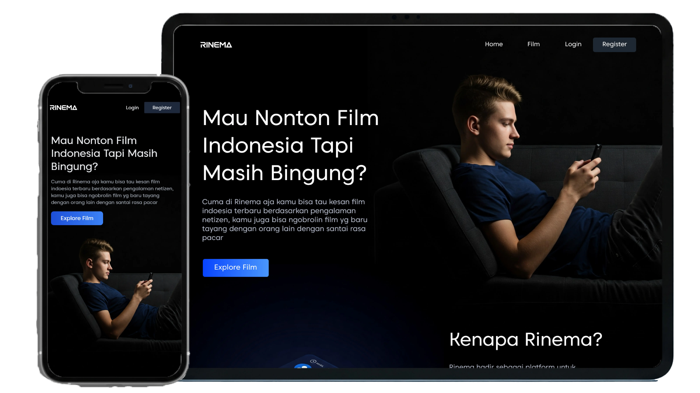

# RINEMA - Platform untuk Pecinta Film Indonesia

[](https://opensource.org/licenses/MIT)
[](https://laravel.com/)
[](https://rinemaa.paramadina.ac.id/)

[](https://www.php.net/)
[](https://laravel.com/)
[](https://tailwindcss.com/)
[](https://developer.mozilla.org/en-US/docs/Web/JavaScript)
[](https://www.mysql.com/)
[](https://cpanel.net/)


**RINEMA** adalah platform digital yang didedikasikan untuk merayakan dan mengeksplorasi sinema Indonesia. Dirancang untuk membangun komunitas pecinta film yang bersemangat, RINEMA menyediakan ruang untuk memberikan rating, berkomentar, berdiskusi, dan masuk dengan mudah menggunakan akun Google. Baik Anda penggemar film layar lebar atau karya independen, RINEMA adalah tempat untuk menyelami kekayaan perfilman Tanah Air.

[README.md](README-en.md) English Ver.

🌟 **Demo Langsung**: Kunjungi RINEMA di [https://rinemaa.paramadina.ac.id/](https://rinemaa.paramadina.ac.id/)

🎬 **Demo Video**: Tonton Demo Rinema di [https://drive.google.com/demo-rinema](https://drive.google.com/file/d/1GFU2u-NRTmvaZKGEcnh3LjmsA2knm4Hj/view?usp=drive_link)

## Daftar Isi

-   [Tentang RINEMA](#tentang-rinema)
-   [Arsitektur Hybrid](#arsitektur-hybrid)
-   [Fitur](#fitur)
-   [Teknologi](#teknologi)
-   [Dokumentasi API](#dokumentasi-api)
-   [Struktur Proyek](#struktur-proyek--mvc-)
-   [Struktur Database](#struktur-database)
-   [UML (Unifiede Modeling Language)](#UML)
-   [Instalasi](#instalasi)
-   [Penggunaan](#penggunaan)
-   [Tangkapan Layar](#tangkapan-layar)
-   [Kontribusi](#kontribusi)
-   [Lisensi](#lisensi)
-   [Kontak](#kontak)

## Tentang RINEMA

Industri perfilman Indonesia sedang mengalami masa keemasan, dengan karya berkualitas yang semakin sering tampil di bioskop dan festival film, baik nasional maupun internasional. Namun, belum ada platform terpusat yang memungkinkan penggemar untuk mengapresiasi dan mendiskusikan film Indonesia secara mendalam. RINEMA hadir untuk mengisi kekosongan ini, terinspirasi oleh platform global seperti IMDb, tetapi dirancang khusus untuk sinema Indonesia.

### Tujuan

-   Membangun platform interaktif untuk pecinta film Indonesia.
-   Mendorong komunitas aktif yang suportif dengan kebebasan berpendapat yang bertanggung jawab.
-   Menyediakan ruang aman untuk rating jujur, komentar terbuka, dan diskusi dinamis tentang film Indonesia.

## Arsitektur Hybrid

Proyek RINEMA dirancang dengan pendekatan hybrid yang unik, menjadikannya sebuah portofolio yang komprehensif:

1. **Aplikasi Web Fungsional**: Proyek ini mencakup aplikasi web lengkap yang dibangun dengan Laravel Blade. Aplikasi ini siap pakai, interaktif, dan berfungsi penuh, menampilkan semua fitur RINEMA secara langsung.

2. **API Terpisah**: Di samping aplikasi web, RINEMA juga menyediakan serangkaian API yang robust. API ini memungkinkan pengembang lain (misalnya Frontend Developer dengan React/Vue atau Mobile Developer) untuk membangun aplikasi klien mereka sendiri dengan menggunakan data dan logika bisnis dari RINEMA.

Pendekatan ini menunjukkan kemampuan dalam membangun baik aplikasi monolitik tradisional maupun backend API yang headless.

## Fitur

-   **Pencarian Film**: Temukan film Indonesia dengan cepat menggunakan kata kunci, seperti judul, sutradara, atau aktor.
-   **Filter Film**: Saring film berdasarkan terpopuler, terbaru, terlawas, atau genre untuk menemukan konten yang sesuai minat Anda.
-   **Mobile-Friendly**: Nikmati pengalaman yang mulus di perangkat mobile dengan desain responsif.
-   **Rating Film**: Berikan penilaian pribadi untuk film yang telah ditonton, ekspresikan suka atau tidak suka secara jujur.
-   **Komentar Bebas**: Tulis pemikiran dan perasaan Anda, dari kritik membangun hingga pujian tanpa batas.
-   **Forum Diskusi**: Ikut serta dalam percakapan seru, bahas detail film, teori, atau kekurangan bersama pengguna lain.
-   **Profil Pengguna**: Kelola aktivitas Anda, lihat riwayat rating, komentar, dan partisipasi di forum.
-   **Manajemen Akun**: Perbarui informasi profil atau hapus akun sesuai kebutuhan.
-   **Login dengan Google**: Masuk dengan cepat dan aman menggunakan akun Google, memudahkan akses ke semua fitur.

## Teknologi

RINEMA dibangun dengan teknologi modern dan andal:

-   **Front-end**:
    -   Laravel Blade (Templating Engine)
    -   Tailwind CSS (Styling)
    -   Vanilla JavaScript (Interaktivitas)
-   **Back-end**:
    -   Laravel 12 (Framework)
    -   PHP
-   **Database**:
    -   MySQL
-   **Integrasi**:
    -   Google OAuth untuk fitur Login dengan Google
-   **Deployment**:
    -   Dihosting melalui cPanel di [https://rinemaa.paramadina.ac.id/](https://rinemaa.paramadina.ac.id/)

## Dokumentasi API

API ini memungkinkan aplikasi eksternal untuk berinteraksi dengan data RINEMA.

**Base URL**: `http://localhost:8000/api` atau `https://rinemaa.paramadina.ac.id/api`

### Autentikasi API

Beberapa endpoint memerlukan autentikasi. API ini menggunakan **Bearer Token** melalui Laravel Sanctum. Untuk mendapatkan token, silakan gunakan endpoint `POST /register` atau `POST /login`.

Sertakan token Anda pada header setiap permintaan ke endpoint yang terproteksi:
`Authorization: Bearer <YOUR_API_TOKEN>`

### Daftar Endpoint API

#### Autentikasi

Endpoint ini digunakan untuk registrasi dan login pengguna.

#### 1. Registrasi Pengguna Baru

-   **Endpoint**: `POST /register`
-   **Deskripsi**: Mendaftarkan pengguna baru ke dalam sistem.
-   **Autentikasi**: Tidak diperlukan.
-   **Body Request (JSON)**:
    ```json
    {
        "name": "Nama User Baru",
        "email": "userbaru@example.com",
        "password": "password123",
        "password_confirmation": "password123"
    }
    ```
-   **Respons Sukses (201 Created)**:
    ```json
    {
        "message": "Registrasi berhasil.",
        "access_token": "1|aBcDeFgHiJkLmNoPqRsTuVwXyZ...",
        "token_type": "Bearer",
        "user": { ... }
    }
    ```

#### 2. Login Pengguna

-   **Endpoint**: `POST /login`
-   **Deskripsi**: Melakukan login untuk pengguna yang sudah terdaftar.
-   **Autentikasi**: Tidak diperlukan.
-   **Body Request (JSON)**:
    ```json
    {
        "email": "userbaru@example.com",
        "password": "password123"
    }
    ```
-   **Respons Sukses (200 OK)**:
    ```json
    {
        "message": "Login berhasil.",
        "access_token": "2|aBcDeFgHiJkLmNoPqRsTuVwXyZ...",
        "token_type": "Bearer",
        "user": { ... }
    }
    ```

#### 3. Login dengan Google (Callback)

-   **Endpoint**: `POST /auth/google/callback`
-   **Deskripsi**: Endpoint yang dihubungi oleh frontend setelah menerima code otorisasi dari Google.
-   **Autentikasi**: Tidak diperlukan.
-   **Body Request (JSON)**:
    ```json
    {
        "code": "4/0AeaYSH... (kode yang didapat dari Google)"
    }
    ```
-   **Respons Sukses (200 OK)**:
    ```json
    {
        "message": "Login dengan Google berhasil.",
        "access_token": "3|aBcDeFgHiJkLmNoPqRsTuVwXyZ...",
        "token_type": "Bearer",
        "user": { ... }
    }
    ```

### Film & Genre (Publik)

Endpoint ini bisa diakses secara publik.

#### 4. Mendapatkan Semua Film

-   **Endpoint**: `GET /films/allFilm`
-   **Autentikasi**: Tidak diperlukan.

#### 5. Mendapatkan Film Terbaru

-   **Endpoint**: `GET /films/latest`
-   **Autentikasi**: Tidak diperlukan.

#### 6. Mendapatkan Film Terlama

-   **Endpoint**: `GET /films/oldest`
-   **Autentikasi**: Tidak diperlukan.

#### 7. Mendapatkan Film Terpopuler

-   **Endpoint**: `GET /films/popular`
-   **Autentikasi**: Tidak diperlukan.

#### 8. Mencari Film

-   **Endpoint**: `GET /films/search?query={nama_film}`
-   **Autentikasi**: Tidak diperlukan.
-   **Query Parameter**:
    -   `query` (wajib): Kata kunci judul film yang ingin dicari.
    -   **Contoh**: `/api/films/search?query=Dilan`

#### 9. Mendapatkan Semua Genre

-   **Endpoint**: `GET /films/allGenre`
-   **Autentikasi**: Tidak diperlukan.

#### 10. Mendapatkan Film Berdasarkan Genre

-   **Endpoint**: `GET /films/genre/{genre}`
-   **Autentikasi**: Tidak diperlukan.
-   **URL Parameter**:
    -   `{genre}` (wajib): ID dari genre.

#### 11. Mendapatkan Detail Film

-   **Endpoint**: `GET /films/{film}`
-   **Autentikasi**: Tidak diperlukan.
-   **URL Parameter**:
    -   `{film}` (wajib): ID dari film.

### Rating (Publik & Terproteksi)

#### 12. Melihat Semua Rating sebuah Film

-   **Endpoint**: `GET /films/{film}/ratingsView`
-   **Autentikasi**: Tidak diperlukan.
-   **URL Parameter**:
    -   `{film}` (wajib): ID dari film.

#### 13. Menyimpan/Memperbarui Rating

-   **Endpoint**: `POST /films/{film}/ratings`
-   **Autentikasi**: Diperlukan (Bearer Token).
-   **URL Parameter**: `{film}` (wajib): ID dari film.
-   **Body Request (JSON)**:
    ```json
    {
        "rating": 8.5,
        "comment": "Komentar saya tentang film ini."
    }
    ```

#### 14. Melihat Rating Spesifik dari Pengguna

-   **Endpoint**: `GET /films/{film}/ratings/user`
-   **Autentikasi**: Diperlukan (Bearer Token).
-   **URL Parameter**: `{film}` (wajib): ID dari film.

#### 15. Menghapus Rating Pengguna

-   **Endpoint**: `DELETE /films/{film}/ratings`
-   **Autentikasi**: Diperlukan (Bearer Token).
-   **URL Parameter**: `{film}` (wajib): ID dari film.

### Forum (Publik & Terproteksi)

#### 16. Melihat Semua Balasan Forum sebuah Film

-   **Endpoint**: `GET /films/{film}/forum-replies`
-   **Autentikasi**: Tidak diperlukan.
-   **URL Parameter**: `{film}` (wajib): ID dari film.

#### 17. Membuat Balasan Baru di Forum

-   **Endpoint**: `POST /films/{film}/forum-replies`
-   **Autentikasi**: Diperlukan (Bearer Token).
-   **URL Parameter**: `{film}` (wajib): ID dari film.
-   **Body Request (JSON)**:
    ```json
    {
        "body": "Isi komentar saya di forum.",
        "parent_reply_id": null
    }
    ```

#### 18. Menghapus Balasan Forum

-   **Endpoint**: `DELETE /forum-replies/{reply}`
-   **Autentikasi**: Diperlukan (Bearer Token).
-   **URL Parameter**: `{reply}` (wajib): ID dari balasan yang ingin dihapus.

#### 19. Mengubah Email Pribadi

-   **Endpoint**: `PUT /user/update-email`
-   **Autentikasi**: Diperlukan (Bearer Token).
-   **Body Request (JSON)**:
    ```json
    {
        "email": "emailbaru@example.com"
    }
    ```

#### 20. Mengubah password Pribadi

-   **Endpoint**: `PUT /user/update-password`
-   **Autentikasi**: Diperlukan (Bearer Token).
-   **Body Request (JSON)**:
    ```json
    {
        "current_password": "password123",
        "new_password": "passwordbaru123",
        "new_password_confirmation": "passwordbaru123"
    }
    ```

#### 21. Menampilkan data Pribadi

-   **Endpoint**: `PUT /user/profil`
-   **Autentikasi**: Diperlukan (Bearer Token).
-   **Respons Sukses (200 OK)**:
    ```json
    {
        "user": {
            "id": 11,
            "name": "demo",
            "email": "demo@gmail.com",
            "role": "user",
            "email_verified_at": null,
            "is_active": 1,
            ...
        }
    }
    ```

## Struktur Proyek ( MVC )

```
RINEMA/
├── app/
│   ├── Http/
│   │    └── Controllers/   # Controller
│   │             └── api/      # API
│   └── Models/             # Model
│
├── resource/
│    └── views/             # Views
│          ├── admin/           # halaman dashboard admin
│          ├── auth/            # halaman autentikasi (login & register)
│          ├── error/           # halaman 404
│          ├── komponen/        # komponen
│          ├── page/            # halaman untuk pengguna
│          └── index.blade.php  # main index
│
└── routes/                  # Handling Route
```

## Struktur Database

```sql
CREATE TABLE users (
    id SERIAL PRIMARY KEY,
    name VARCHAR(255) NOT NULL,
    email VARCHAR(255) UNIQUE NOT NULL,
    username VARCHAR(255) UNIQUE NOT NULL,
    password TEXT NOT NULL,
    role VARCHAR(50) DEFAULT 'user',
    is_active BOOLEAN DEFAULT TRUE,
    avatar VARCHAR(255) NULL,
    last_login TIMESTAMP NULL,
    created_at TIMESTAMP DEFAULT CURRENT_TIMESTAMP,
    updated_at TIMESTAMP DEFAULT CURRENT_TIMESTAMP
);

CREATE TABLE films (
    id SERIAL PRIMARY KEY,
    name VARCHAR(255) NOT NULL,
    description TEXT NOT NULL,
    release_date DATE NOT NULL,
    director VARCHAR(255) NOT NULL,
    poster VARCHAR(255) NOT NULL,
    duration INT NOT NULL,
    is_active BOOLEAN DEFAULT TRUE,
    created_at TIMESTAMP DEFAULT CURRENT_TIMESTAMP,
    updated_at TIMESTAMP DEFAULT CURRENT_TIMESTAMP
);

CREATE TABLE genres (
    id SERIAL PRIMARY KEY,
    name VARCHAR(100) UNIQUE NOT NULL
);

CREATE TABLE film_genre (
    film_id INT REFERENCES films(id) ON DELETE CASCADE,
    genre_id INT REFERENCES genres(id) ON DELETE CASCADE,
    PRIMARY KEY (film_id, genre_id)
);

CREATE TABLE ratings (
    id SERIAL PRIMARY KEY,
    user_id INT REFERENCES users(id) ON DELETE CASCADE,
    film_id INT REFERENCES films(id) ON DELETE CASCADE,
    rating DECIMAL(2,1) CHECK (rating BETWEEN 0 AND 10),
    comment TEXT NULL,
    created_at TIMESTAMP DEFAULT CURRENT_TIMESTAMP,
    updated_at TIMESTAMP DEFAULT CURRENT_TIMESTAMP,
    UNIQUE (user_id, film_id)
);

CREATE TABLE forums (
    id SERIAL PRIMARY KEY,
    film_id INT REFERENCES films(id) ON DELETE CASCADE,
    user_id INT REFERENCES users(id) ON DELETE CASCADE,
    title VARCHAR(255) NOT NULL,
    is_active BOOLEAN DEFAULT TRUE,
    created_at TIMESTAMP DEFAULT CURRENT_TIMESTAMP,
    updated_at TIMESTAMP DEFAULT CURRENT_TIMESTAMP
);

CREATE TABLE forum_replies (
    id SERIAL PRIMARY KEY,
    forum_id INT REFERENCES forums(id) ON DELETE CASCADE,
    user_id INT REFERENCES users(id) ON DELETE CASCADE,
    parent_reply_id INT NULL REFERENCES forum_replies(id) ON DELETE CASCADE,
    reply TEXT NOT NULL,
    created_at TIMESTAMP DEFAULT CURRENT_TIMESTAMP,
    updated_at TIMESTAMP DEFAULT CURRENT_TIMESTAMP
);
```

## UML

### Class Diagram


## Instalasi

Untuk menjalankan RINEMA secara lokal, ikuti langkah-langkah berikut:

### Prasyarat

-   PHP >= 8.1
-   Composer
-   MySQL
-   Node.js & npm
-   Git
-   Akun Google Developer untuk konfigurasi OAuth (opsional untuk fitur Login dengan Google)

### Langkah Instalasi

1. **Kloning Repositori**:

    ```bash
    git clone https://github.com/ichramsyah/rinema-fullstack-webapp.git
    cd rinema
    ```

2. **Instal Dependensi**:

    ```bash
    composer install
    npm install
    ```

3. **Konfigurasi Lingkungan**:

    - Salin file `.env.example` menjadi `.env`:
        ```bash
        cp .env.example .env
        ```
    - Perbarui `.env` dengan kredensial database dan Google OAuth (jika menggunakan fitur Login dengan Google):

        ```env
        DB_CONNECTION=mysql
        DB_HOST=127.0.0.1
        DB_PORT=3306
        DB_DATABASE=rinema
        DB_USERNAME=nama_pengguna_anda
        DB_PASSWORD=kata_sandi_anda

        GOOGLE_CLIENT_ID=your_google_client_id
        GOOGLE_CLIENT_SECRET=your_google_client_secret
        GOOGLE_REDIRECT_URI=http://localhost:8000/auth/google/callback
        ```

4. **Buat Kunci Aplikasi**:

    ```bash
    php artisan key:generate
    ```

5. **Jalankan Migrasi Database**:

    ```bash
    php artisan migrate
    ```

6. **Bangun Aset Front-end**:

    ```bash
    npm run dev
    ```

7. **Jalankan Server Pengembangan**:
    ```bash
    php artisan serve
    ```
    Akses RINEMA di `http://localhost:8000`.

### Catatan untuk Login dengan Google

-   Buat kredensial OAuth di [Google Developer Console](https://console.developers.google.com/).
-   Tambahkan kredensial ke file `.env` seperti di atas.
-   Pastikan rute callback (`/auth/google/callback`) sesuai dengan pengaturan aplikasi Anda.

## Penggunaan

1. **Daftar/Masuk**: Buat akun baru, masuk dengan email, atau gunakan Login dengan Google untuk akses cepat.
2. **Jelajahi Film**: Telusuri film Indonesia dan lihat detail seperti pemeran, sutradara, dan sinopsis.
3. **Beri Rating & Komentar**: Bagikan penilaian dan opini Anda tentang film yang telah ditonton.
4. **Ikuti Diskusi**: Bergabung di forum untuk membahas alur, tema, atau teori bersama pengguna lain.
5. **Kelola Profil**: Lihat riwayat aktivitas Anda dan perbarui pengaturan akun.

## Tangkapan Layar

Berikut adalah pratinjau halaman utama RINEMA :

-   **Halaman Beranda**

    

-   **Halaman Film**

    

-   **Halaman Detail Film**

    

-   **Forum Diskusi**

    

-   **Pemberian Rating**

    

-   **Halaman Login**

    

-   **Halaman Register**

    

-   **Halaman Profil**

    

-   **Halaman Dashboard Admin**

    

## Kontribusi

Kami menyambut kontribusi untuk membuat RINEMA semakin baik! Untuk berkontribusi:

1. Fork repositori ini.
2. Buat cabang baru (`git checkout -b fitur/nama-fitur`).
3. Lakukan perubahan dan commit (`git commit -m "Menambahkan fitur"`).
4. Push ke cabang (`git push origin fitur/nama-fitur`).
5. Buka Pull Request dengan deskripsi jelas tentang perubahan Anda.

Harap patuhi [Kode Etik](CODE_OF_CONDUCT.md) kami dan pastikan kontribusi Anda sejalan dengan misi RINEMA untuk diskusi yang konstruktif dan hormat.

### Saran Kontribusi

-   Tingkatkan fitur pencarian dan filter (misalnya, berdasarkan genre atau sutradara).
-   Tambahkan upvote/downvote untuk komentar atau balasan bertingkat di forum.
-   Integrasikan rekomendasi film berdasarkan aktivitas pengguna.
-   Kembangkan alat moderasi untuk menjaga diskusi yang sehat.

## Lisensi

Proyek ini dilisensikan di bawah Lisensi MIT. Lihat file [LICENSE](LICENSE.txt) untuk detailnya.

## Kontak

Untuk pertanyaan, umpan balik, atau peluang kolaborasi, hubungi tim RINEMA:

-   **Email**: ichramsyahabdurrachman@gmail.com

Bergabunglah dengan kami untuk merayakan sinema Indonesia bersama RINEMA! 🎥
